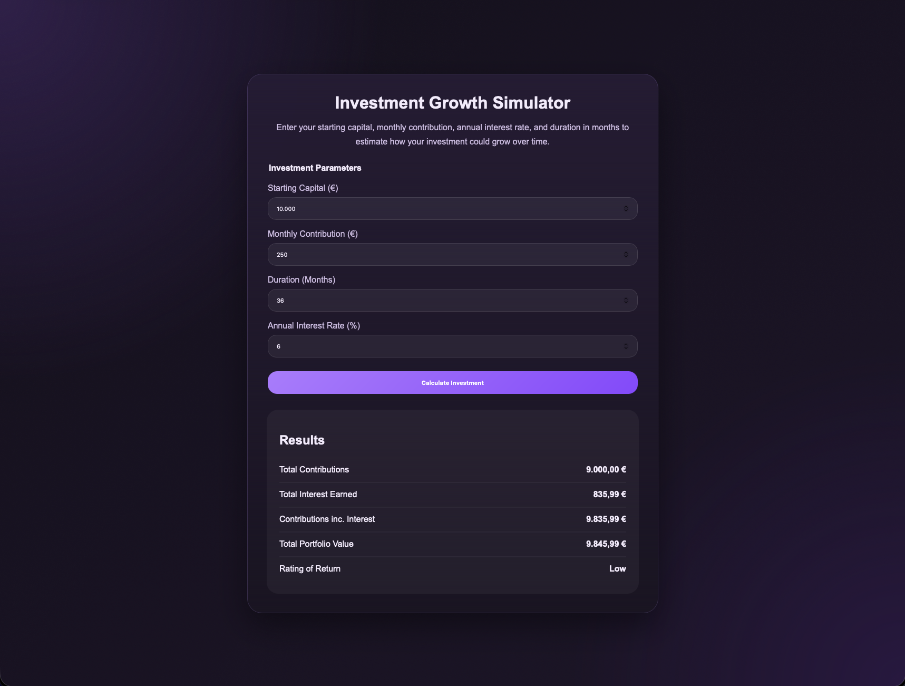

# Investment Growth Simulator


## Live Demo
https://dove1405.github.io/investment-growth-simulator-foundation

## Preview



A simple web-based investment calculator that estimates how an investment portfolio may grow over time using monthly contributions and compound interest.

The simulator allows users to enter starting capital, monthly contributions, investment duration in months, and an annual interest rate to calculate projected portfolio growth.

---

## Features

* Input starting capital
* Define monthly contribution
* Investment duration in months
* Annual interest rate
* Monthly compound interest calculation
* Structured investment results overview

The simulator calculates:

* **Total Contributions** – Sum of all monthly contributions
* **Total Interest Earned** – Profit generated by compound interest
* **Contributions inc. Interest** – Contributions including the generated profit
* **Total Portfolio Value** – Starting capital + contributions + interest
* **Rating of Return** – Simple performance classification

---

## How It Works

The calculator simulates monthly compound growth.

For every month:

1. Interest is applied to the current portfolio value.
2. The monthly contribution is added to the portfolio.

This process repeats for the full investment duration.

The formula used conceptually:

Portfolio = (Portfolio × Monthly Interest Rate) + Monthly Contribution

The annual interest rate is converted to a monthly rate:

Monthly Rate = Annual Rate / 12

---

## Project Structure

```
investment-growth-simulator
│
├── index.html
├── style.css
├── script.js
└── README.md
```

---

## Technologies Used

* HTML5
* CSS3
* JavaScript (Vanilla JS)

No frameworks or external libraries are used.

---

## Example Use Case

Example input:

Starting Capital: 10,000 €
Monthly Contribution: 250 €
Duration: 120 months
Annual Interest Rate: 6 %

The simulator calculates the estimated portfolio growth and displays the investment breakdown.

---

## Purpose of the Project

This project was created as part of a learning journey in web development to practice:

* Structuring web applications
* Building forms with HTML
* Styling interfaces with CSS
* Implementing calculations with JavaScript
* Handling user input and dynamic results

---

## Future Improvements

Possible enhancements:

* Investment charts and visual growth graphs
* Currency selection
* Inflation adjustment
* Export results
* Scenario comparison

---

## License

This project is open source and available for educational purposes.
